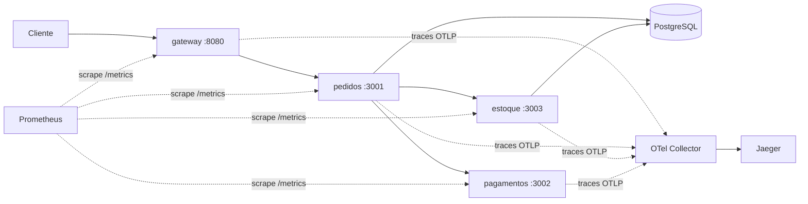

# Loja Veloz — Pedidos Veloz (Cloud DevOps)

Plataforma de pedidos em microsserviços: **Docker Compose** (dev) → **Kubernetes** (produção) com **CI/CD**, **observabilidade** (Prometheus + OpenTelemetry/Jaeger), **HPA** e **Terraform**.

- 📄 Relatórios: `docs/relatorio-teorico.pdf` e `docs/relatorio-pratico.pdf`

## Arquitetura



| Serviço | Porta | Função |
|---|---|---|
| gateway | 8080 | Entrada HTTP (`POST /api/pedidos`, `GET /api/pedidos/:id`) |
| pedidos | 3001 | Orquestra: reserva estoque → paga → grava pedido (com compensação se o pagamento falhar) |
| pagamentos | 3002 | Simula integração externa (falha configurável por `PAGAMENTO_FALHA_PERCENT`) |
| estoque | 3003 | Reserva atômica de itens (transação no PostgreSQL) |

Todos expõem `/healthz` (liveness), `/readyz` (readiness) e `/metrics` (Prometheus).

## 1. Ambiente local (um único comando)

Pré-requisito: Docker com Compose v2.

```bash
cp .env.example .env          # ajuste as senhas locais
docker compose up --build -d  # sobe tudo: serviços, banco, collector, Jaeger, Prometheus
./scripts/smoke.sh            # cria e consulta um pedido de ponta a ponta
```

| O quê | Onde |
|---|---|
| API | http://localhost:8080 |
| Traces (Jaeger) | http://localhost:16686 |
| Métricas (Prometheus) | http://localhost:9090 |

Encerrar: `docker compose down -v`. Redes: `frontend` (só o gateway) e `backend` (interna). Volume: `pgdata`.

Testar falha de pagamento: `PAGAMENTO_FALHA_PERCENT=100` no `.env` e `docker compose up -d`.

## 2. Testes e lint

```bash
cd services && npm ci && npm run lint && npm test
```

## 3. Imagens

Um `Dockerfile` multi-stage (`services/Dockerfile`) gera as 4 imagens via `--build-arg SERVICE=<nome>`: usuário não-root, apenas dependências de produção, `HEALTHCHECK`, `exec` para receber SIGTERM. Tags no CI: `sha-<commit>`, `x.y.z` (tags `vX.Y.Z`) e `latest`, publicadas no GHCR.

## 4. Kubernetes

```bash
# Cluster local (kind) — exige metrics-server para o HPA e ingress-nginx para o Ingress
docker compose build
for s in gateway pedidos pagamentos estoque; do kind load docker-image loja-veloz/$s:local; done
kubectl apply -f k8s/base/namespace.yaml
kubectl -n loja-veloz create secret generic loja-veloz-secrets \
  --from-literal=POSTGRES_USER=veloz --from-literal=POSTGRES_PASSWORD='<senha>' \
  --from-literal=DATABASE_URL='postgres://veloz:<senha>@postgres:5432/pedidos' \
  --from-literal=PAYMENT_PROVIDER_API_KEY='<chave>'
kubectl apply -k k8s/overlays/local
kubectl apply -f k8s/observability/observability.yaml     # collector + Jaeger
kubectl -n loja-veloz get pods,hpa
kubectl -n loja-veloz port-forward svc/gateway 8080:8080  # e rode ./scripts/smoke.sh
```

Produção: `k8s/overlays/prod` (ajuste `OWNER` em `kustomization.yaml`; o pipeline troca as tags). Métricas em produção: `helm install kube-prometheus-stack` + `k8s/observability/servicemonitor.yaml`.

Destaques: Rolling Update `maxUnavailable: 0`, probes (startup/readiness/liveness), requests/limits, HPA (CPU 70%), PDB, NetworkPolicies (default-deny), Pod Security Admission `restricted`, `securityContext` (non-root, read-only rootfs, drop ALL, seccomp), ConfigMap/Secret. Canary opcional com Istio: `k8s/extras/`.

## 5. CI/CD (`.github/workflows/ci-cd.yml`)

`test` (lint + testes) → `validate` (hadolint, kubeconform, terraform validate) → `build-push` (build, **Trivy**, push GHCR, cache) → `deploy` (ambiente `production`, `rollout status` + **rollback automático**).

Secrets necessários (Settings → Secrets → Actions): `KUBE_CONFIG_B64`, `POSTGRES_PASSWORD`, `PAYMENT_PROVIDER_API_KEY`. O push no GHCR usa o `GITHUB_TOKEN`.

## 6. Infraestrutura como código

`infra/terraform`: VPC + EKS (módulos oficiais), variáveis por ambiente (`envs/*.tfvars`), backend S3 (comentado).
`terraform init && terraform plan -var-file=envs/dev.tfvars`

## Limitações conhecidas (transparência)

- Validado aqui: lint, testes unitários (6/6), execução dos serviços com tracing e sintaxe/estrutura dos YAMLs. **Não** foram executados `docker compose up`, cluster Kubernetes real, pipeline no GitHub nem `terraform apply`.
- Postgres em StatefulSet é só para o MVP (produção: banco gerenciado). Jaeger usa armazenamento em memória.
- Mensageria não adotada no MVP (ver relatório): o evento `PedidoCriado` é registrado em log, pronto para migrar a RabbitMQ/Kafka.
